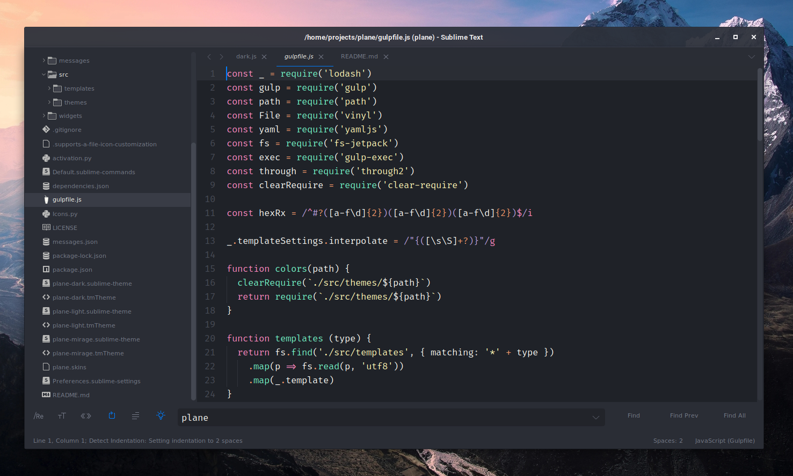

<p align="center">

</p>


# PLANE-SUBLIME THEME

A beautiful theme for Sublime text, more information in [Plane project](https://github.com/wfpaisa/plane)


### File Icons

`plane` Supports customization via [A File Icon](https://github.com/ihodev/a-file-icon) package. Please install it and restart Sublime for better experience.

### Screenshots
<p align="center">

<br>
</p>

### Settings

```js
"ui_native_titlebar":       true, // use native titlebars on macOs
"ui_separator":             true, // separators between panels
"ui_font_size_small":       true, // smaller UI font size(sidebar, statusbar etc)
"ui_font_roboto_mono":      true, // use Roboto Mono (https://fonts.google.com/specimen/Roboto+Mono) as UI font
"ui_wide_scrollbars":       true, // wider scrollbars
```

---

### Installation

###### Manual

1. Download the [latest release](https://github.com/wfpaisa/plane-sublime), extract and rename the directory to `plane`.
2. Move the directory inside your sublime `/Packages` directory. *(Preferences > Browse packages...)*

---

### Activation

###### Recommended

Open command palette via `Tools > Command Palette` (or <kbd>cmd/ctrl</kbd> + <kbd>shift</kbd> + <kbd>p</kbd>) and type `plane: Activate theme`.


###### Via Preferences

Add these lines to your user settings *Preferences > Setting - User*:

For dark theme:

```js
"theme": "plane-dark.sublime-theme",
"color_scheme": "Packages/plane/plane-dark.tmTheme",
```

For light theme:

```js
"theme": "plane-light.sublime-theme",
"color_scheme": "Packages/plane/plane-light.tmTheme",
```

### Thanks to

- `ayu`: https://github.com/dempfi/ayu


## Build
It's necessary nodev8 nvm: `nvm use v8`, and run with `npm run watch` or `npm run build`.

theme folder:  `./src`, colors in: `./src/themes` 